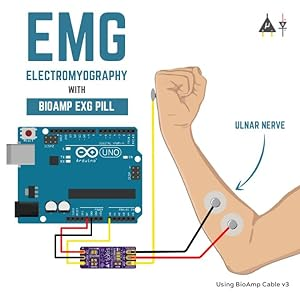

# ECG Digital Modulation

This project demonstrates the digital modulation of ECG (Electrocardiogram) signals using Python and Arduino. Using the Bio Amp EXG Pill, we measure ECG signals and send them to a laptop through Arduino, where the signals are processed and visualized in real-time with digital modulation techniques like Amplitude Shift Keying (ASK) and Frequency Shift Keying (FSK).

## Project Overview

The project reads analog ECG data via the Bio Amp EXG Pill connected to an Arduino analog input and transmits this data to a computer over a serial connection. The Python script then visualizes this ECG data by displaying:
- The Digital Signal representation of ECG values.
- The Carrier Signal for modulation.
- ASK Modulation: Amplitude Shift Keying modulated signal.
- FSK Modulation: Frequency Shift Keying modulated signal.

## Picture Overview


## Hardware Requirements

- Arduino (any model with an analog input pin, e.g., A0).
- Bio Amp EXG Pill for ECG measurement.

## Software Requirements

- Python 3.x
- Arduino IDE for uploading code to Arduino
- Python libraries: numpy, matplotlib, serial

## Installation and Setup

1. **Install Python Dependencies**  
   Install necessary libraries using pip:

   ```bash
   pip install numpy matplotlib pyserial
   ```
2.	Upload Arduino Code
Open the Arduino IDE, copy the following code, and upload it to your Arduino:
```bash
void setup() {
  Serial.begin(9600);
}

void loop() {
  int sensorValue = analogRead(A0); // Reading from A0
  Serial.print("a0: ");
  Serial.println(sensorValue);
  delay(500); // Adjust the delay as needed
}
```

This code reads the ECG signal from the analog pin A0, labels it as “a0: “, and sends it via serial.

3.	Configure Serial Port in Python
In the Python script, adjust the serial_port to match your system’s serial port for Arduino.

5.	Run the Python Script
Execute the main Python script to visualize the signals:

python modulation.py


## Visualization

The Python script creates real-time animated plots using Matplotlib:
	•	Digital Signal derived from ECG values.
	•	Carrier Signal used for modulation.
	•	ASK Modulated Signal showing amplitude modulation.
	•	FSK Modulated Signal showing frequency modulation.

## Repository Structure

	•	modulation.py: Python script for digital modulation visualization.
	•	Arduino.ino Code: Arduino code to read and transmit ECG data from the Bio Amp EXG Pill.

## License

This project is licensed under the MIT License.
